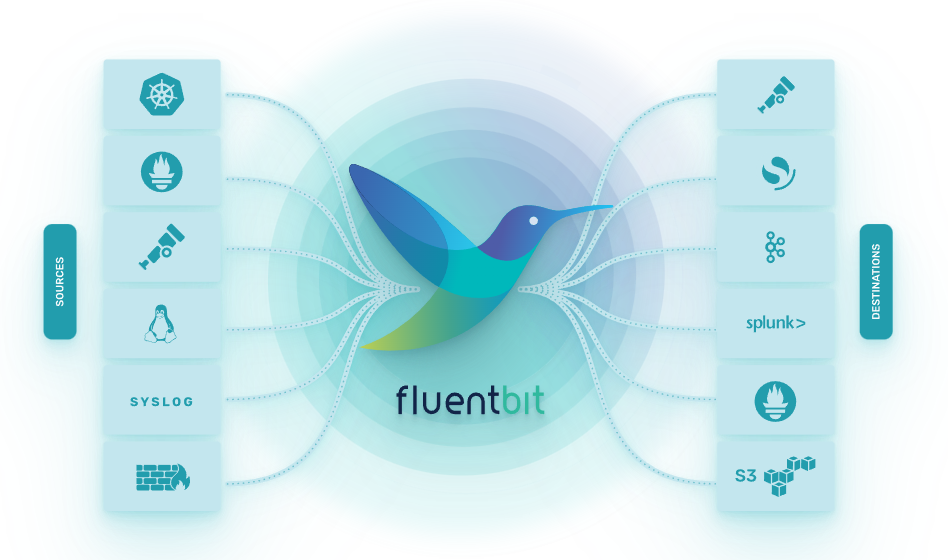

# Fluent Bit Demo

[Fluent Bit](https://fluentbit.io/) is a super fast, lightweight, and highly scalable logging and metrics processor and forwarder. It is the preferred choice for cloud and containerized environments.



## Setup

Make sure that you have installed Docker, docker-compose, kompose and kafkacat (wsl). I suggest to use [choco](https://github.com/costigator/installnotes/blob/master/windows.md):

```ps
choco install docker-desktop
choco install kubernetes-kompose
```

## Run

Run the logging pipeline locally, connect to the server and generate some logs:

```sh
docker-compose up --build
docker exec -it server bash
rsyslogd
logger Hello World
```

P.S.: logs with the same content will be ignored (default settings)

## Check

### CLI

Logstash:

```sh
curl "localhost:9200/_search?pretty" -H 'Content-Type: application/json' -d'{ "query": { "match_all": {} }}'
```

Kafka:

```sh
kafkacat -b localhost:29092 -t test
```

### UI

- Kibana (Logstash UI): http://localhost:5601
- MinIO (Object Storage): http://localhost:9001

## Clean up

Stop the containers with CTRL+C and run `docker-compose rm -f` to destroy all the containers.

## Production

In production we will not use docker-compose but Kubernetes. The manifests can be converted with [Kompose](https://kompose.io/):

```sh
kompose convert -f ../docker-compose.yml
```
